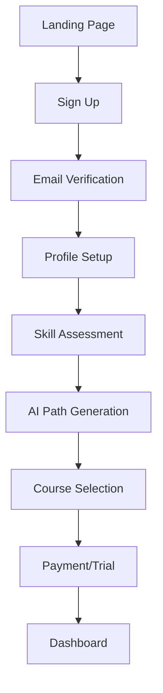
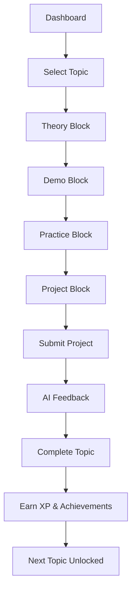
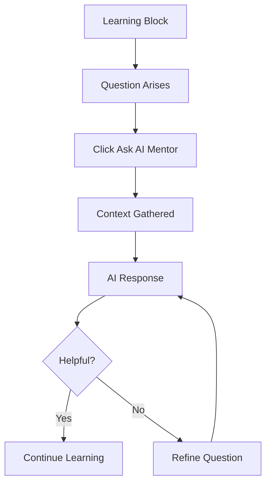

# Academy LMS UI Mockups & User Flows

## User Flows

### 1. New User Onboarding Flow


### 2. Learning Flow


### 3. AI Mentor Interaction Flow


## Page Mockups

### 1. Landing Page
```
┌─────────────────────────────────────────────────────────────┐
│ [Logo] InTime Academy          [Courses] [Pricing] [Login]  │
├─────────────────────────────────────────────────────────────┤
│                                                             │
│   🚀 Master Guidewire. Land Your Dream Job.                │
│                                                             │
│   AI-powered learning paths personalized to your           │
│   experience level and career goals.                       │
│                                                             │
│   ┌─────────────────────┐  ┌─────────────────────┐        │
│   │  Start Free Trial   │  │   Watch Demo (2m)  │        │
│   └─────────────────────┘  └─────────────────────┘        │
│                                                             │
│   ⭐⭐⭐⭐⭐ "Got hired in 3 months!" - Sarah K.            │
│                                                             │
├─────────────────────────────────────────────────────────────┤
│                   Why InTime Academy?                       │
│                                                             │
│  ┌───────────┐  ┌───────────┐  ┌───────────┐             │
│  │    AI     │  │  Gamified │  │   Real    │             │
│  │Personalized│ │ Learning  │  │ Projects  │             │
│  └───────────┘  └───────────┘  └───────────┘             │
│                                                             │
│  ┌───────────┐  ┌───────────┐  ┌───────────┐             │
│  │   Job     │  │   Live    │  │ Career    │             │
│  │  Ready    │  │ Mentors   │  │ Support   │             │
│  └───────────┘  └───────────┘  └───────────┘             │
├─────────────────────────────────────────────────────────────┤
│                    Success Stories                          │
│  ┌─────────┐  ┌─────────┐  ┌─────────┐  ┌─────────┐      │
│  │ +$30K   │  │ 3 Month │  │  From   │  │  500+   │      │
│  │ Salary  │  │  Avg.   │  │Support  │  │Students │      │
│  │Increase │  │ to Job  │  │to Senior│  │ Placed  │      │
│  └─────────┘  └─────────┘  └─────────┘  └─────────┘      │
└─────────────────────────────────────────────────────────────┘
```

### 2. Learner Dashboard
```
┌─────────────────────────────────────────────────────────────┐
│ 🏠 Dashboard  📚 Topics  🏆 Achievements  📊 Progress       │
│                                         Sarah K. | Lvl 7 🔥7 │
├─────┬───────────────────────────────────────────────────────┤
│     │  Welcome back, Sarah! 🎯 Daily Goal: 2 Topics         │
│  S  │  ┌─────────────────────────────────────────────┐     │
│  i  │  │  Current: ClaimCenter Configuration          │     │
│  d  │  │  Progress: ████████░░ 75% | 45 XP to Lvl 8  │     │
│  e  │  └─────────────────────────────────────────────┘     │
│  b  │                                                        │
│  a  │  📈 Your Learning Path - Week 3 of 12                 │
│  r  │  ┌────┐ ┌────┐ ┌────┐ ┌────┐ ┌────┐                │
│     │  │ ✓  │→│ ✓  │→│ 75%│→│ 🔒 │→│ 🔒 │                │
│  2  │  └────┘ └────┘ └────┘ └────┘ └────┘                │
│  4  │  Config  Rules  Current Workflow Integration          │
│  0  │                                                        │
│  p  │  🎯 Today's Missions                                  │
│  x  │  ┌─────────────────┐ ┌─────────────────┐            │
│     │  │ □ Complete      │ │ □ Perfect Score │            │
│     │  │   Topic 15      │ │   on Quiz       │            │
│     │  │   +50 XP        │ │   +30 XP        │            │
│     │  └─────────────────┘ └─────────────────┘            │
│     │                                                        │
│     │  🏅 Recent Achievements                               │
│     │  ┌───┐ ┌───┐ ┌───┐  3 New!                          │
│     │  │⚡│ │🎯│ │🔥│  Speed Demon, Perfect, Streak       │
│     │  └───┘ └───┘ └───┘  +150 XP Total                   │
│     │                                                        │
│     │  💬 AI Mentor Says:                                   │
│     │  "Great progress! Consider reviewing Rules before     │
│     │   starting Workflow - it builds on those concepts."   │
└─────┴───────────────────────────────────────────────────────┘
```

### 3. Learning Topic Page
```
┌─────────────────────────────────────────────────────────────┐
│ ← Back to Topics          Topic 15: Claims Configuration    │
├─────────────────────────────────────────────────────────────┤
│  Learning Blocks     [Theory] [Demo] [Practice] [Project]  │
│  Progress               ✓      ✓       ⚪        ⚪        │
├─────────────────────────────────────────────────────────────┤
│                                                             │
│  ┌─────────────────────────────────────────────────────┐  │
│  │                                                      │  │
│  │           VIDEO: Claims Configuration Demo           │  │
│  │                                                      │  │
│  │         [────────────────▶────] 12:34 / 18:00      │  │
│  │                                                      │  │
│  └─────────────────────────────────────────────────────┘  │
│                                                             │
│  📝 AI-Generated Notes        💡 Key Concepts   ❓ Q&A    │
│  ┌─────────────────────────────────────────────────────┐  │
│  │ • Rule inheritance determines validation order       │  │
│  │ • Always check parent rules before creating new     │  │
│  │ • Common mistake: Duplicate validation logic        │  │
│  │                                                      │  │
│  │ 🎯 Interview Tip: Be ready to explain why          │  │
│  │    inheritance matters in large implementations     │  │
│  └─────────────────────────────────────────────────────┘  │
│                                                             │
│  [Mark Complete & Continue] [Ask AI Mentor] [Resources]    │
└─────────────────────────────────────────────────────────────┘
```

### 4. AI Project Generator
```
┌─────────────────────────────────────────────────────────────┐
│              🤖 AI Project Generator                        │
├─────────────────────────────────────────────────────────────┤
│                                                             │
│  Based on your profile: 3 years Java, Insurance domain     │
│                                                             │
│  Generated Project: Multi-Channel Claims Integration        │
│  Complexity: ⭐⭐⭐⭐ (Matches your experience)            │
│  Estimated Time: 6-8 hours                                  │
│                                                             │
│  📋 Scenario:                                              │
│  ┌─────────────────────────────────────────────────────┐  │
│  │ ACME Insurance is migrating from a legacy claims    │  │
│  │ system to ClaimCenter. They need to support:        │  │
│  │ • Email claim submissions                            │  │
│  │ • Mobile app integration                             │  │
│  │ • Legacy system data migration                       │  │
│  │ • Real-time status updates                           │  │
│  └─────────────────────────────────────────────────────┘  │
│                                                             │
│  📌 Your Tasks:                                            │
│  1. ☐ Design the integration architecture                  │
│  2. ☐ Implement email parser for claims                    │
│  3. ☐ Create REST API for mobile app                      │
│  4. ☐ Build data migration scripts                         │
│  5. ☐ Set up notification system                           │
│                                                             │
│  💡 AI Hints Available: 5 (Use wisely!)                   │
│                                                             │
│  [Download Full Project Brief] [Start Project] [Regenerate]│
└─────────────────────────────────────────────────────────────┘
```

### 5. Gamification - Achievements Page
```
┌─────────────────────────────────────────────────────────────┐
│                    🏆 Achievements                          │
├─────────────────────────────────────────────────────────────┤
│  Progress: 24/50 Unlocked          Filter: [All] [Recent]  │
├─────────────────────────────────────────────────────────────┤
│                                                             │
│  🔓 Unlocked                                               │
│  ┌─────────┐ ┌─────────┐ ┌─────────┐ ┌─────────┐         │
│  │   🚀    │ │   ⚡    │ │   🎯    │ │   🔥    │         │
│  │First    │ │Speed    │ │Perfect  │ │Week     │         │
│  │Steps    │ │Learner  │ │Shot     │ │Warrior  │         │
│  │         │ │         │ │         │ │         │         │
│  │ +50 XP  │ │+200 XP  │ │+150 XP  │ │+250 XP  │         │
│  └─────────┘ └─────────┘ └─────────┘ └─────────┘         │
│                                                             │
│  🔒 Locked (Next Up)                                       │
│  ┌─────────┐ ┌─────────┐ ┌─────────┐                     │
│  │   🧠    │ │   🏗️    │ │   👥    │                     │
│  │Knowledge│ │Builder  │ │Community│                     │
│  │Seeker   │ │         │ │Hero     │                     │
│  │ 8/10    │ │ 7/10    │ │ 3/10    │ Progress            │
│  │+150 XP  │ │+300 XP  │ │+100 XP  │                     │
│  └─────────┘ └─────────┘ └─────────┘                     │
│                                                             │
│  🏆 Legendary (Secret)                                     │
│  ┌─────────┐ ┌─────────┐ ┌─────────┐                     │
│  │   ???   │ │   ???   │ │   ???   │                     │
│  │         │ │         │ │         │                     │
│  │   ???   │ │   ???   │ │   ???   │                     │
│  └─────────┘ └─────────┘ └─────────┘                     │
└─────────────────────────────────────────────────────────────┘
```

### 6. Leaderboard
```
┌─────────────────────────────────────────────────────────────┐
│                    📊 Leaderboard                           │
├─────────────────────────────────────────────────────────────┤
│  [Weekly] [Monthly] [All-Time] [My Organization]           │
├─────────────────────────────────────────────────────────────┤
│                                                             │
│  🥇 Top Performers This Week                               │
│                                                             │
│  ┌──┬─────────────────────────────┬────────┬──────┐       │
│  │# │ Learner                     │ XP     │ Lvl  │       │
│  ├──┼─────────────────────────────┼────────┼──────┤       │
│  │1 │ 👤 Michael Chen            │ 2,450  │ 12   │       │
│  │2 │ 👤 Lisa Rodriguez          │ 2,380  │ 11   │       │
│  │3 │ 👤 James Park              │ 2,150  │ 10   │       │
│  │..│ ...                        │ ...    │ ...  │       │
│  │7 │ 👤 You (Sarah K.)          │ 1,850  │ 7    │ ⬆3    │
│  └──┴─────────────────────────────┴────────┴──────┘       │
│                                                             │
│  📈 Your Stats This Week                                   │
│  ┌────────────┐ ┌────────────┐ ┌────────────┐            │
│  │ Topics: 12 │ │ XP: 1,850  │ │ Rank: #7   │            │
│  └────────────┘ └────────────┘ └────────────┘            │
│                                                             │
│  🎯 Weekly Challenge: Complete 15 Topics                   │
│  Progress: ████████████░░░░ 12/15 (80%)                   │
│  Reward: 500 XP + "Dedicated Learner" Badge               │
└─────────────────────────────────────────────────────────────┘
```

### 7. Enterprise Dashboard (Manager View)
```
┌─────────────────────────────────────────────────────────────┐
│  InTime Academy Enterprise - ACME Insurance                 │
│                                    John Smith (Admin) 🔔 📊  │
├─────┬───────────────────────────────────────────────────────┤
│     │  Team Overview                     [Export] [Settings]│
│  E  │  ┌──────────┐ ┌──────────┐ ┌──────────┐ ┌─────────┐│
│  n  │  │ Active   │ │ Avg      │ │ Complete │ │ ROI     ││
│  t  │  │ 45/50    │ │ 67%      │ │ 23       │ │ $2.3M   ││
│  e  │  │ Learners │ │ Progress │ │ Courses  │ │ Saved   ││
│  r  │  └──────────┘ └──────────┘ └──────────┘ └─────────┘│
│  p  │                                                        │
│  r  │  📊 Department Progress                               │
│  i  │  ┌─────────────────────────────────────────────┐     │
│  s  │  │ Claims      ████████████████░░░░ 82%       │     │
│  e  │  │ Underwriting ██████████░░░░░░░░ 65%        │     │
│     │  │ IT          ████████████░░░░░░ 71%         │     │
│  M  │  │ Customer    ███████░░░░░░░░░░░ 45%        │     │
│  e  │  └─────────────────────────────────────────────┘     │
│  n  │                                                        │
│  u  │  👥 Top Performers              🚨 Need Attention     │
│     │  1. Sarah Kim (Claims)         • Tom Wilson (0%)     │
│     │  2. Mike Chen (IT)             • Amy Lee (12%)       │
│     │  3. Lisa Park (UW)             • Bob Jones (8%)      │
│     │                                                        │
│     │  📅 Upcoming Milestones                               │
│     │  • Mar 15: ClaimCenter Basics Deadline (89% ready)   │
│     │  • Mar 30: Q1 Certification Target (On Track)        │
│     │  • Apr 15: PolicyCenter Rollout Begins               │
└─────┴───────────────────────────────────────────────────────┘
```

## Component Library

### 1. XP Animation Component
```tsx
<XPGainAnimation
  amount={50}
  reason="Topic Completed"
  onComplete={() => updateUI()}
/>
```
- Floats up with fade
- Number counting animation
- Particle effects for large gains

### 2. Streak Indicator
```tsx
<StreakIndicator
  days={7}
  isActive={true}
  nextMilestone={10}
/>
```
- Fire emoji animation
- Milestone celebration
- Calendar view on hover

### 3. AI Mentor Chat
```tsx
<AIMentorChat
  context={currentTopic}
  userProfile={profile}
  onQuestion={handleQuestion}
/>
```
- Floating action button
- Context-aware suggestions
- Typing indicators
- Code highlighting support

### 4. Progress Path Visualization
```tsx
<LearningPath
  topics={topics}
  currentProgress={progress}
  onTopicClick={navigateToTopic}
/>
```
- Connected nodes
- Lock/unlock animations
- Progress fill effects
- Hover previews

### 5. Achievement Notification
```tsx
<AchievementUnlock
  achievement={newAchievement}
  xpEarned={150}
  onDismiss={handleDismiss}
/>
```
- Slide in from right
- Confetti burst
- Sound effect (optional)
- Auto-dismiss after 5s

## Mobile Responsive Designs

### Mobile Dashboard
- Bottom navigation bar
- Swipeable mission cards
- Condensed progress view
- Pull-to-refresh

### Mobile Learning
- Full-screen video
- Swipe between blocks
- Bottom sheet for AI notes
- Floating progress indicator

### Touch Interactions
- Swipe to navigate topics
- Long press for previews
- Pinch to zoom diagrams
- Pull down to close modals

## Interaction States

### Loading States
- Skeleton screens for content
- Progress spinners for actions
- Optimistic updates
- Background sync indicators

### Error States
- Inline error messages
- Retry mechanisms
- Offline mode support
- Graceful degradation

### Success States
- Celebration animations
- Progress updates
- Next step suggestions
- Social sharing options

## Accessibility Features

### Screen Reader Support
- Semantic HTML structure
- ARIA live regions for updates
- Descriptive button labels
- Progress announcements

### Keyboard Navigation
- Tab through all elements
- Enter/Space activation
- Escape closes modals
- Arrow keys for menus

### Visual Accessibility
- High contrast mode
- Focus indicators
- Color-blind friendly
- Scalable typography

## Performance Optimizations

### Image Loading
- Progressive JPEGs
- WebP with fallbacks
- Lazy loading
- Blur-up placeholders

### Code Splitting
- Route-based splitting
- Component lazy loading
- Dynamic imports
- Vendor chunking

### Caching Strategy
- Service worker
- CDN for static assets
- Local storage for progress
- Optimistic updates


