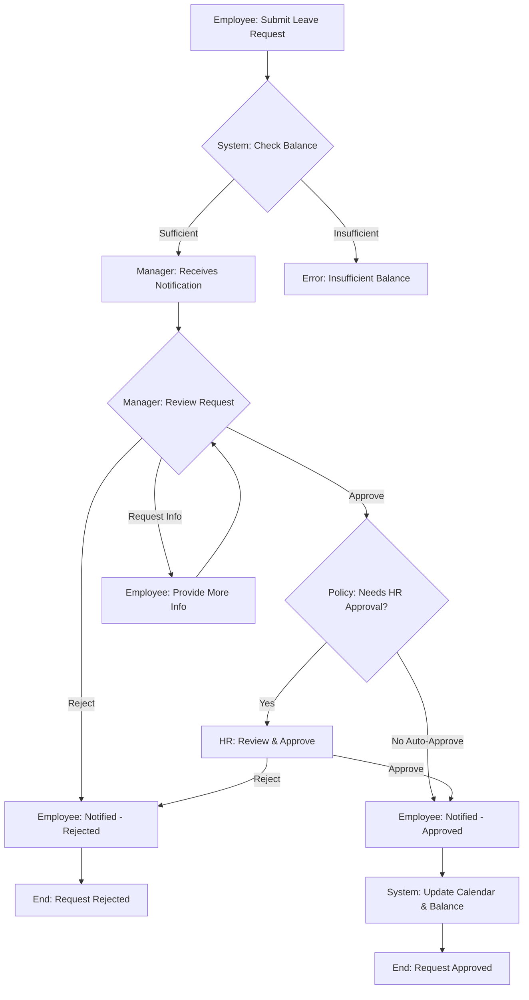
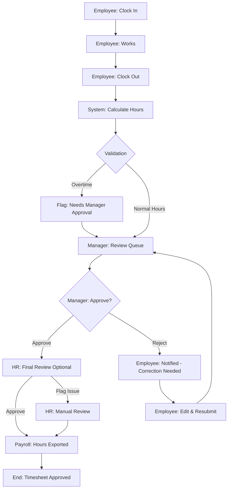
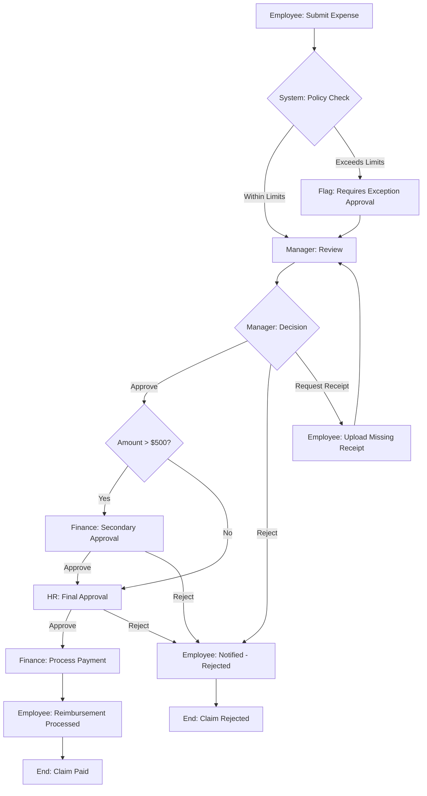

# HR Workflows - Detailed Documentation
**Date:** December 2024  
**Status:** Phase 3 Complete

---

## TABLE OF CONTENTS

### Employee Lifecycle
1. [New Employee Onboarding](#workflow-1-new-employee-onboarding)
2. [Employee Profile Updates](#workflow-2-employee-profile-updates)
3. [Employee Termination](#workflow-3-employee-termination)

### Leave Management
4. [Employee Leave Request](#workflow-4-employee-leave-request)
5. [Manager Leave Approval](#workflow-5-manager-leave-approval)
6. [HR Leave Policy Management](#workflow-6-hr-leave-policy-management)

### Time & Attendance
7. [Employee Clock In/Out](#workflow-7-employee-clock-inout)
8. [Manager Timesheet Review](#workflow-8-manager-timesheet-review)
9. [HR Attendance Processing](#workflow-9-hr-attendance-processing)

### Expense Management
10. [Employee Expense Submission](#workflow-10-employee-expense-submission)
11. [Manager Expense Approval](#workflow-11-manager-expense-approval)
12. [HR Expense Reimbursement](#workflow-12-hr-expense-reimbursement)

### Performance Management
13. [HR Initiate Review Cycle](#workflow-13-hr-initiate-review-cycle)
14. [Manager Conduct Review](#workflow-14-manager-conduct-review)
15. [Employee View Feedback](#workflow-15-employee-view-feedback)

### Reporting
16. [Generate Attendance Report](#workflow-16-generate-attendance-report)
17. [Department Analytics Review](#workflow-17-department-analytics-review)
18. [Compliance Reporting](#workflow-18-compliance-reporting)

---

## WORKFLOW 1: New Employee Onboarding

**Role:** HR Manager  
**Frequency:** As needed (new hires)  
**Estimated Time:** 30-45 minutes  
**System Path:** `/hr/employees` → Add New Employee

### Prerequisites
- ✅ Offer letter accepted
- ✅ Start date confirmed
- ✅ Department and role identified
- ✅ Email account created
- ✅ Required documents collected

### Step-by-Step Process

#### Step 1: Navigate to Employee Management
**Action:**
1. Log in to HR Portal at `/hr/dashboard`
2. Click **"Employees"** in left sidebar navigation
3. System loads Employee Directory

**Expected Result:**
- URL changes to `/hr/employees`
- Table displays current employee list
- "Add Employee" button visible in top-right

**Screenshot Checkpoint:** `onboarding-step1-directory.png`

#### Step 2: Initiate New Employee Form
**Action:**
1. Click **"+ Add Employee"** button (top-right corner)
2. System opens employee creation form

**Expected Result:**
- Modal or new page opens
- Form displays with tabs: Personal Info, Employment, Contact, Documents
- All required fields marked with asterisk (*)

**Screenshot Checkpoint:** `onboarding-step2-form-blank.png`

#### Step 3: Fill Personal Information
**Action:**
Fill in the following fields:

**Personal Details:**
- **Employee ID**: `EMP-2024-001` (Auto-generated or manual)
- **First Name**: `John`
- **Middle Name**: `Michael` (optional)
- **Last Name**: `Doe`
- **Date of Birth**: `01/15/1990` (Use date picker)
- **Gender**: `Male` (Dropdown)
- **Marital Status**: `Single` (Dropdown)
- **Nationality**: `American` (Dropdown)

**Screenshot Checkpoint:** `onboarding-step3-personal-filled.png`

#### Step 4: Fill Employment Information
**Action:**
Click **"Employment"** tab and fill:

**Employment Details:**
- **Department**: `Engineering` (Dropdown)
- **Role**: `Software Engineer` (Dropdown)
- **Designation**: `Senior Software Engineer`
- **Employment Type**: `Full-time` (Dropdown: Full-time/Part-time/Contract)
- **Employment Status**: `Active` (Auto-selected)
- **Hire Date**: `03/01/2024` (Date picker)
- **Reporting Manager**: `Jane Smith - Engineering Manager` (Searchable dropdown)
- **Work Location**: `New York Office` (Dropdown)

**Screenshot Checkpoint:** `onboarding-step4-employment-filled.png`

#### Step 5: Fill Contact Information
**Action:**
Click **"Contact"** tab and fill:

**Contact Details:**
- **Work Email**: `john.doe@intimesolutions.com` (Auto-populated or manual)
- **Personal Email**: `john.m.doe@gmail.com`
- **Phone**: `+1 (555) 123-4567`
- **Alternate Phone**: `+1 (555) 987-6543` (optional)

**Current Address:**
- **Street**: `123 Main Street, Apt 4B`
- **City**: `New York`
- **State**: `NY`
- **ZIP**: `10001`
- **Country**: `USA`

**Emergency Contact:**
- **Name**: `Jane Doe`
- **Relationship**: `Spouse`
- **Phone**: `+1 (555) 234-5678`

**Screenshot Checkpoint:** `onboarding-step5-contact-filled.png`

#### Step 6: Upload Documents
**Action:**
Click **"Documents"** tab and upload:

**Required Documents:**
- **Resume/CV**: `john_doe_resume.pdf` (Drag & drop or click upload)
- **ID Proof**: `drivers_license_scan.pdf`
- **Education Certificates**: `diploma.pdf`
- **Previous Employment Letter**: `experience_letter.pdf` (optional)

**Screenshot Checkpoint:** `onboarding-step6-documents-uploaded.png`

#### Step 7: Review and Submit
**Action:**
1. Click **"Review"** tab
2. Verify all entered information
3. Check the confirmation checkbox: ☑️ "I confirm all information is accurate"
4. Click **"Create Employee"** button

**Expected Result:**
- Form validation runs
- If validation passes:
  - Success message appears: ✅ "Employee John Doe created successfully!"
  - Redirect to employee profile page
- If validation fails:
  - Error messages appear next to invalid fields (red text)
  - Form stays on current tab with errors highlighted

**Screenshot Checkpoint:** `onboarding-step7-success.png`

### What Happens Behind the Scenes

**Database Operations:**
```sql
-- 1. Insert into employees table
INSERT INTO employees (
  employee_id, first_name, last_name, email, 
  department_id, role_id, hire_date, employment_status, ...
) VALUES (...);

-- 2. Create leave balances for current year
INSERT INTO leave_balances (
  employee_id, leave_type_id, year, entitled_days
) VALUES 
  (new_employee_id, 'annual_leave', 2024, 15),
  (new_employee_id, 'sick_leave', 2024, 10),
  (new_employee_id, 'personal_leave', 2024, 3);

-- 3. Create default shift assignment
INSERT INTO employee_shifts (
  employee_id, shift_id, effective_from
) VALUES (new_employee_id, default_shift_id, hire_date);

-- 4. Log audit entry
INSERT INTO hr_audit_log (
  user_id, action, entity_type, entity_id, changes
) VALUES (...);
```

**Notifications Sent:**
- ✉️ Welcome email to new employee (work email)
- ✉️ New hire notification to reporting manager
- ✉️ IT ticket for equipment/access provisioning
- ✉️ Payroll team notification

**System Triggers:**
- User account created in auth.users
- Default permissions assigned
- Employee added to department roster
- Manager notified of new team member

### Alternative Paths

**If Duplicate Email:**
- Error: "Email already exists in system"
- Action: Use different email or reactivate existing employee
- Check: Search for email in inactive employees

**If Department Not Found:**
- Error: "Selected department does not exist"
- Action: Create department first via admin panel
- Workaround: Assign to "Unassigned" temporarily

**If Reporting Manager Inactive:**
- Warning: "Selected manager is not active"
- Action: Choose active manager or update manager status

### Tips & Best Practices

**Before Starting:**
- ✓ Verify offer letter has been signed
- ✓ Confirm start date with hiring manager
- ✓ Prepare employee ID naming convention
- ✓ Have all documents ready for upload

**During Process:**
- ✓ Use consistent date format (MM/DD/YYYY)
- ✓ Double-check email spelling
- ✓ Ensure phone numbers include country code
- ✓ Select correct department and reporting manager
- ✓ Upload documents in PDF format for consistency

**After Completion:**
- ✓ Verify employee receives welcome email
- ✓ Check manager receives notification
- ✓ Confirm leave balances initialized correctly
- ✓ Verify employee can log into self-service portal
- ✓ Schedule orientation meeting

### Common Issues & Solutions

| Issue | Cause | Solution |
|-------|-------|----------|
| "Employee ID already exists" | Duplicate ID | Use auto-generated ID or check existing records |
| "Email domain not allowed" | Personal email used for work | Use company domain email |
| Document upload fails | File size > 10MB | Compress file or use link |
| Manager dropdown empty | No managers in department | Assign to department head temporarily |
| Date picker not working | Browser compatibility | Use manual date entry (MM/DD/YYYY) |

### Validation Rules

**Required Fields:**
- First Name, Last Name
- Employee ID (unique)
- Work Email (unique, company domain)
- Department
- Role
- Hire Date
- Employment Type/Status

**Optional Fields:**
- Middle Name
- Personal Email
- Alternate Phone
- All address fields except current address

**Business Rules:**
- Hire date cannot be in future (unless pending start)
- Employee ID must match company format
- Work email must be unique across active employees
- Reporting manager must be in same or parent department

---

## WORKFLOW 2: Employee Profile Updates

**Role:** Employee (Self-Service) → Manager → HR  
**Frequency:** As needed  
**Estimated Time:** 10-15 minutes  
**System Path:** `/hr/self-service` → Edit Profile

### Prerequisites
- ✅ Employee logged into self-service portal
- ✅ Valid reason for update
- ✅ Supporting documents (if applicable)

### Step-by-Step Process

#### Step 1: Access Self-Service Portal
**Action:**
1. Employee logs in at `/hr/self-service`
2. Dashboard displays personal information card
3. Click **"Edit Profile"** button

**Expected Result:**
- Profile edit form opens
- Current information pre-filled
- Editable fields enabled
- Read-only fields (like Employee ID) disabled

**Screenshot Checkpoint:** `profile-update-step1-view.png`

#### Step 2: Update Information
**Action:**
Employee can update the following:

**Editable by Employee:**
- Personal Email
- Alternate Phone
- Current Address
- Emergency Contact information
- Bank Details (for payroll)

**Requires Approval:**
- Legal Name changes (requires documents)
- Marital Status changes
- Nationality changes

**Read-Only (HR Only):**
- Employee ID
- Work Email
- Department
- Role/Designation
- Employment Status

**Example Update:**
- Change Personal Email from `old@gmail.com` to `new@gmail.com`
- Update Current Address: `456 New Street, Apt 2A, Brooklyn, NY 11201`
- Add Emergency Contact: `John Doe Sr. (Father) - +1 (555) 888-9999`

**Screenshot Checkpoint:** `profile-update-step2-edited.png`

#### Step 3: Submit Changes
**Action:**
1. Review changes in summary section
2. Add reason for change (optional text field): "Moved to new apartment"
3. Upload supporting documents if needed
4. Click **"Submit Changes"** button

**Expected Result:**
- Changes marked as "Pending Approval"
- Notification sent to reporting manager
- Employee sees confirmation: "Profile update submitted for approval"
- Status indicator shows "Pending" on edited fields

**Screenshot Checkpoint:** `profile-update-step3-submitted.png`

#### Step 4: Manager Review (Manager Role)
**Action by Manager:**
1. Manager receives notification
2. Navigate to **"Team"** → **"Pending Updates"**
3. Review employee's requested changes
4. Verify legitimacy of updates
5. Click **"Approve"** or **"Reject"** with optional comments

**Manager Decision Points:**
- Address change: ✅ Approve (legitimate)
- Bank details: ✅ Approve (with verification)
- Emergency contact: ✅ Approve

**Screenshot Checkpoint:** `profile-update-step4-manager-review.png`

#### Step 5: HR Final Approval (HR Role)
**Action by HR:**
1. HR receives notification after manager approval
2. Navigate to `/hr/employees` → **"Pending Changes"** tab
3. Review change history
4. Verify supporting documents
5. Click **"Approve & Apply Changes"**

**Expected Result:**
- Changes applied to employee record
- Employee notified: "Your profile updates have been approved"
- Manager notified: "Profile update processed"
- Audit log entry created

**Screenshot Checkpoint:** `profile-update-step5-hr-final.png`

### What Happens Behind the Scenes

**Database:**
```sql
-- 1. Create change request record
INSERT INTO profile_change_requests (
  employee_id, field_name, old_value, new_value, 
  status, requested_by, requested_at
) VALUES (...);

-- 2. Manager approval
UPDATE profile_change_requests 
SET manager_approved_by = ?, manager_approved_at = NOW(), 
    status = 'Manager Approved'
WHERE id = ?;

-- 3. HR approval and apply changes
UPDATE employees 
SET personal_email = ?, current_address = ?, 
    updated_by = ?, updated_at = NOW()
WHERE id = ?;

UPDATE profile_change_requests 
SET hr_approved_by = ?, hr_approved_at = NOW(), 
    status = 'Completed', applied_at = NOW()
WHERE id = ?;
```

**Notifications:**
- Employee → "Change request submitted"
- Manager → "Profile update awaiting your review"
- HR → "Profile change approved by manager, needs final approval"
- Employee → "Your changes have been approved"

### Alternative Paths

**Rejection by Manager:**
```
Manager clicks "Reject" →
  Reason required: "Please provide updated documents"
  →  Employee notified
  → Employee can revise and resubmit
```

**Rejection by HR:**
```
HR clicks "Reject" →
  Reason: "Address verification document needed"
  → Employee and Manager notified
  → Request returns to Draft status
```

**Emergency Override (HR Only):**
```
Critical update needed →
  HR clicks "Apply Immediately" →
  Skips approval workflow →
  Manager notified post-facto
```

### Tips & Best Practices

**For Employees:**
- Always provide supporting documents for major changes
- Use clear reason in change request
- Keep personal contact information updated
- Review changes before submitting

**For Managers:**
- Review changes within 24 hours
- Verify legitimacy with employee directly if unsure
- Check for unusual patterns (multiple address changes)

**For HR:**
- Audit trail is automatically maintained
- Cross-check major changes with submitted documents
- Update payroll system if bank details changed
- Notify IT if contact information affects system access

---

## WORKFLOW 3: Employee Leave Request

**Role:** Employee (Self-Service)  
**Frequency:** As needed  
**Estimated Time:** 5-10 minutes  
**System Path:** `/hr/self-service` → Apply for Leave

### Prerequisites
- ✅ Employee has available leave balance
- ✅ Dates selected don't conflict with existing requests
- ✅ Minimum notice period met (default: 1 day)

### Detailed Steps

#### Step 1: Access Leave Application
**Click Path:** Dashboard → **"Apply for Leave"** button in Quick Actions

**Expected:**
- Form opens with leave type selection
- Current leave balances displayed at top
- Calendar view shows team availability

**Screenshot:** `leave-request-step1-form.png`

#### Step 2: Select Leave Type and Dates
**Form Fields:**
1. **Leave Type**: Dropdown
   - Annual Leave (Balance: 12 days)
   - Sick Leave (Balance: 5 days)
   - Personal Leave (Balance: 3 days)
   - Unpaid Leave

2. **From Date**: `12/20/2024` (Date picker)
   - Calendar highlights unavailable dates
   - Shows team members on leave

3. **To Date**: `12/22/2024` (Date picker)
   - Auto-calculates: **3 days**

4. **Half Day Options**:
   - [ ] First day half day (Morning/Afternoon)
   - [ ] Last day half day (Morning/Afternoon)

**Real-time Validations:**
- ✓ Balance check: "You have 12 days available"
- ✓ Minimum notice: "Request submitted 10 days in advance ✓"
- ⚠️ If insufficient: "Insufficient balance. You have 2 days, requesting 3"

**Screenshot:** `leave-request-step2-dates-selected.png`

#### Step 3: Add Reason and Documents
**Action:**
1. **Reason for Leave**: (Text area, max 500 chars)
   ```
   "Family vacation. Planned trip to visit parents."
   ```

2. **Attach Documents** (if required):
   - For medical leave: Upload doctor's note
   - For emergency leave: Supporting documentation
   - Drag & drop or click to upload
   - Supported formats: PDF, JPG, PNG (max 5MB)

**Screenshot:** `leave-request-step3-details.png`

#### Step 4: Review and Submit
**Action:**
1. Review summary panel (right side):
   ```
   Leave Type: Annual Leave
   Duration: Dec 20 - Dec 22, 2024 (3 days)
   Current Balance: 12 days
   Balance After: 9 days
   Status: Pending Manager Approval
   ```

2. Click **"Submit Request"** button

**Expected Result:**
- Success message: ✅ "Leave request submitted successfully!"
- Request status: "Pending Approval"
- Notification sent to manager
- Email confirmation sent to employee
- Calendar updated with "Pending" status
- Redirect to: Self-service dashboard with request visible in "Recent Requests"

**Screenshot:** `leave-request-step4-submitted.png`

### What Happens Behind the Scenes

**Database:**
```sql
-- Insert leave request
INSERT INTO leave_requests (
  employee_id, leave_type_id, from_date, to_date, 
  total_days, reason, status, created_at
) VALUES (
  employee_uuid, leave_type_uuid, '2024-12-20', '2024-12-22',
  3.0, 'Family vacation...', 'Pending', NOW()
);

-- Update leave balance (pending days)
UPDATE leave_balances 
SET pending_days = pending_days + 3
WHERE employee_id = employee_uuid 
  AND leave_type_id = leave_type_uuid 
  AND year = 2024;

-- Create workflow instance
INSERT INTO workflow_instances (
  workflow_template_id, entity_type, entity_id, 
  current_step, status, created_by
) VALUES (
  'leave_approval_workflow', 'leave_request', new_request_id,
  0, 'Active', employee_uuid
);
```

**Notifications:**
1. **To Employee:**
   - Email: "Your leave request has been submitted"
   - In-app: "Leave request pending approval"

2. **To Manager:**
   - Email: "Leave request from John Doe awaits your approval"
   - In-app notification badge: "1 pending approval"
   - Push notification (if enabled)

3. **To HR (optional):**
   - Dashboard: Pending requests counter incremented

### Alternative Scenarios

**Scenario A: Insufficient Balance**
```
Request: 5 days Annual Leave
Available: 2 days
→ System shows error: "Insufficient balance"
→ Options: 
   1. Request less days
   2. Apply for Unpaid Leave
   3. Check if previous year's carryover is available
```

**Scenario B: Notice Period Not Met**
```
Request: Leave starting tomorrow
Policy: 3 days minimum notice
→ System warns: "Minimum 3 days notice required"
→ Options:
   1. Select later dates
   2. Mark as "Emergency Leave" (requires reason)
   3. Contact manager for exception
```

**Scenario C: Date Conflicts**
```
Request: Dec 20-22
Conflict: Team member on leave Dec 21-23
→ System flags: ⚠️ "Team coverage may be affected"
→ Manager approval required with override reason
```

**Scenario D: Save as Draft**
```
Employee not ready to submit →
  Click "Save as Draft" →
  Request saved with status "Draft" →
  Can edit and submit later
```

### Tips & Best Practices

**For Employees:**
- ✅ Check team calendar before requesting
- ✅ Submit requests well in advance (recommended: 2 weeks for 3+ days)
- ✅ Always provide clear reason
- ✅ Upload documents for medical/emergency leaves
- ✅ Coordinate with teammates for coverage
- ✅ Review leave balance before planning vacations

**Planning Tips:**
- Book leave for popular periods early (summer, holidays)
- Check company holiday calendar
- Consider team workload
- Inform manager verbally before submitting for major leaves

### Success Metrics
- Request submitted: ✅
- Manager notified: ✅
- Leave balance reserved: ✅
- Calendar updated: ✅
- Audit trail created: ✅

---

## WORKFLOW 5: Manager Leave Approval

**Role:** Manager  
**Frequency:** Daily/Weekly (as requests come in)  
**Estimated Time:** 3-5 minutes per request  
**System Path:** `/hr/dashboard` → Pending Approvals OR `/hr/leave/requests`

### Prerequisites
- ✅ Manager has team members reporting to them
- ✅ Manager has "approve_leave" permission
- ✅ Leave request submitted by team member

### Detailed Steps

#### Step 1: View Pending Approvals
**Access Options:**

**Option A - Dashboard Widget:**
1. Log in to `/hr/dashboard`
2. Locate **"Pending Approvals"** card (if HR role)
3. See list of pending items with counts
   - 🟡 Leave Requests: **3 pending**
   - 🟡 Expense Claims: **2 pending**
   - 🟡 Timesheets: **5 pending**

4. Click **"Leave Requests"** → opens approval page

**Option B - Direct Navigation:**
1. Click **"Leave"** in sidebar
2. Select **"Requests"** submenu
3. System loads leave requests table
4. Filter by **"Status: Pending"** + **"My Team"**

**Expected Result:**
- Table shows all pending leave requests for manager's team
- Columns: Employee, Type, Dates, Days, Reason, Submitted, Actions
- Requests sorted by submission date (oldest first)

**Screenshot:** `leave-approval-step1-queue.png`

#### Step 2: Review Leave Request Details
**Action:**
1. Click on row or **"View Details"** button for specific request
2. Request details modal opens

**Information Displayed:**
```
┌─────────────────────────────────────────┐
│ Leave Request Details                    │
├─────────────────────────────────────────┤
│ Employee: John Doe (EMP-2024-001)       │
│ Department: Engineering                  │
│                                          │
│ Leave Type: Annual Leave                 │
│ From: Dec 20, 2024 (Thu)                │
│ To: Dec 22, 2024 (Sat)                  │
│ Total Days: 3 days                      │
│                                          │
│ Current Balance: 12 days                │
│ Balance After: 9 days                   │
│                                          │
│ Reason: Family vacation. Planned trip   │
│         to visit parents.                │
│                                          │
│ Documents: No attachments               │
│                                          │
│ Submitted: Dec 10, 2024 10:30 AM       │
│ Status: ⏳ Pending Manager Approval     │
│                                          │
│ Team Coverage Check:                     │
│ ⚠️ Sarah Chen on leave Dec 21-23       │
│ ✓ Mike Johnson available               │
│ ✓ Project deadlines: None affected     │
└─────────────────────────────────────────┘
```

**Screenshot:** `leave-approval-step2-details.png`

#### Step 3: Make Decision
**Manager Considerations:**
- Team coverage adequacy
- Project deadlines
- Historical leave patterns
- Employee performance
- Business impact

**Actions Available:**

**Option A: Approve**
1. Click **"Approve"** button (green)
2. Optional: Add comment: "Approved. Enjoy your time off!"
3. Click **"Confirm Approval"**

**Option B: Reject**
1. Click **"Reject"** button (red)
2. **Required:** Rejection reason (dropdown + text):
   - Reason Category: `Insufficient Coverage`
   - Details: "Critical project deadline Dec 21. Please consider alternate dates."
3. Click **"Confirm Rejection"**

**Option C: Request More Info**
1. Click **"Request Information"** button (yellow)
2. Add comment: "Please provide project handover plan"
3. Request stays pending, employee notified

**Screenshot:** `leave-approval-step3-decision.png`

#### Step 4: Confirmation
**After Approval:**
- ✅ Success message: "Leave request approved"
- Request status changes to: "Approved - Pending HR"
- Employee notified immediately
- HR notified (auto-approve if policy allows, else HR review)
- Team calendar updated
- Leave balance adjusted (pending → used)

**After Rejection:**
- ⚠️ Request status: "Rejected"
- Employee email: "Your leave request was not approved" + reason
- Leave balance restored (pending → available)
- Employee can revise and resubmit

**Screenshot:** `leave-approval-step4-confirmed.png`

### What Happens Behind the Scenes

**On Approval:**
```sql
-- Update leave request status
UPDATE leave_requests 
SET status = 'Approved',
    approved_by = manager_uuid,
    approved_at = NOW()
WHERE id = request_uuid;

-- Update leave balance
UPDATE leave_balances 
SET pending_days = pending_days - 3,
    used_days = used_days + 3
WHERE employee_id = employee_uuid 
  AND leave_type_id = leave_type_uuid 
  AND year = 2024;

-- Workflow action log
INSERT INTO workflow_actions (
  workflow_instance_id, step_number, action, 
  actor_id, comments
) VALUES (workflow_uuid, 1, 'Approved', manager_uuid, 'Approved. Enjoy...');

-- Notification to employee
INSERT INTO hr_notifications (
  recipient_id, type, subject, message
) VALUES (
  employee_uuid, 'Email', 'Leave Approved',
  'Your leave request for Dec 20-22 has been approved.'
);
```

**On Rejection:**
```sql
-- Update request status
UPDATE leave_requests 
SET status = 'Rejected',
    approved_by = manager_uuid,
    approved_at = NOW(),
    rejection_reason = 'Insufficient coverage. Critical project...'
WHERE id = request_uuid;

-- Restore leave balance
UPDATE leave_balances 
SET pending_days = pending_days - 3
WHERE employee_id = employee_uuid 
  AND leave_type_id = leave_type_uuid;

-- Log rejection
INSERT INTO workflow_actions (
  workflow_instance_id, step_number, action, 
  actor_id, comments
) VALUES (workflow_uuid, 1, 'Rejected', manager_uuid, '...');
```

### Alternative Paths

**Auto-Approval Scenario:**
```
If: Leave ≤ 1 day AND Balance available AND No conflicts
Then: Manager approval auto-granted
      HR approval auto-granted
      Employee immediately notified
```

**Escalation Scenario:**
```
If: No manager action within 48 hours
Then: Auto-escalate to HR
      HR can approve on manager's behalf
      Manager notified of timeout
```

**Multi-Level Approval:**
```
If: Leave > 5 consecutive days
Then: Requires both Manager + Department Head
      Workflow adds extra approval step
```

### Tips for Managers

**Quick Approval Guidelines:**
- ✅ 1-2 days: Usually approve unless critical deadline
- ⚠️ 3-5 days: Check team calendar and coverage
- 🔴 5+ days: Review project timelines, plan handover

**Red Flags to Watch:**
- Multiple requests just before deadlines
- Pattern of Monday/Friday leaves
- Insufficient advance notice
- Missing documentation for medical leaves

**Bulk Actions:**
- Select multiple requests with checkboxes
- Click "Approve Selected" for batch approval
- Useful for processing multiple simple requests

---

## WORKFLOW 7: Employee Clock In/Out

**Role:** Employee  
**Frequency:** Daily (2x per day minimum)  
**Estimated Time:** 30 seconds per action  
**System Path:** `/hr/self-service` → Time Clock OR `/hr/timesheets/clock`

### Prerequisites
- ✅ Employee is logged in
- ✅ Employee is at work location (if geofencing enabled)
- ✅ Shift start time has arrived (for clock-in)

### Clock-In Process

#### Step 1: Access Time Clock
**Navigation:**
- Quick option: Dashboard → **"Clock In"** button (if displayed based on time)
- OR: Self-service → **"Timesheets"** → **"Clock In/Out"**

**Expected:**
- Large **"Clock In"** button displayed
- Current time shown: `08:00 AM`
- Today's date: `Monday, Dec 18, 2024`
- Shift info: `Regular Shift: 9:00 AM - 5:00 PM`

**Screenshot:** `clock-step1-ready.png`

#### Step 2: Perform Clock-In
**Action:**
1. Click **"Clock In"** button
2. System captures:
   - Timestamp: `2024-12-18 08:00:15`
   - Location: `40.7128° N, 74.0060° W` (if GPS enabled)
   - IP Address: `192.168.1.100`
   - Device: `Mobile - iOS`

**Expected Result:**
- ✅ Success message: "Clocked in successfully at 8:00 AM"
- Button changes to **"Clock Out"** (disabled until break or end of day)
- Timer starts: "Working time: 00:00:15"
- Status indicator: 🟢 "On Duty"

**Screenshot:** `clock-step2-clocked-in.png`

### Clock-Out Process

#### Step 1: Access Time Clock (End of Day)
**Current Time:** `05:00 PM`
**Status:** 🟢 On Duty (Working: 09:00:00)

**Action:**
- Click **"Clock Out"** button

#### Step 2: Perform Clock-Out
**System Captures:**
- Timestamp: `2024-12-18 17:00:30`
- Total hours: `9 hours 15 minutes` (auto-calculated)
- Break time: `1 hour` (if breaks were logged)
- Net hours: `8 hours 15 minutes`

**Validation Checks:**
- ✓ Minimum hours met (if policy exists)
- ⚠️ If < required hours: "You've worked 6 hours. Required: 8 hours. Continue?"
- ✓ If overtime: "Overtime: 15 minutes. Needs approval."

**Expected Result:**
- ✅ "Clocked out at 5:00 PM"
- Summary shown:
  ```
  Today's Summary:
  Clock In: 8:00 AM
  Clock Out: 5:00 PM
  Break Time: 1 hour
  Total Hours: 9 hours 15 min
  Net Hours: 8 hours 15 min
  Overtime: 15 min
  Status: ⏳ Pending Approval
  ```
- **Options:**
  - ✅ "Submit Timesheet" → Send for manager approval
  - 📝 "Add Note" → Explain overtime/early departure
  - ❌ "Discard" → Delete today's entry (if allowed)

**Screenshot:** `clock-step3-clocked-out.png`

### Break Management

**Taking a Break:**
1. During work hours, click **"Start Break"**
2. System records break start time
3. Button changes to **"End Break"**
4. Click "End Break" when returning
5. System calculates break duration

**Lunch Break Auto-Deduction:**
- If policy: "Auto-deduct 1 hour lunch"
- System automatically subtracts from total hours
- No manual break logging required

### What Happens Behind the Scenes

**Database - Clock In:**
```sql
INSERT INTO timesheets (
  employee_id, date, shift_id, 
  clock_in, status
) VALUES (
  employee_uuid, '2024-12-18', shift_uuid,
  '2024-12-18 08:00:15', 'In Progress'
);

INSERT INTO attendance (
  employee_id, date, status
) VALUES (
  employee_uuid, '2024-12-18', 'Present'
);
```

**Database - Clock Out:**
```sql
UPDATE timesheets 
SET clock_out = '2024-12-18 17:00:30',
    total_hours = 9.25,
    overtime_hours = 0.25,
    status = 'Submitted'
WHERE employee_id = employee_uuid 
  AND date = '2024-12-18';
```

### Alternative Paths

**Forgot to Clock In:**
```
Employee arrives at 8 AM, forgets to clock in
→ Realizes at 10 AM
→ Options:
   1. Clock in now (late flag)
   2. Request manager to adjust time
   3. Submit manual timesheet entry
```

**Forgot to Clock Out:**
```
Employee leaves at 5 PM, forgets to clock out
→ System auto-clocks out at shift end time (5 PM)
→ Next day: Warning shown "Auto-clocked out yesterday"
→ Employee can confirm or request correction
```

**Multiple Clock-Ins (Split Shift):**
```
Morning: Clock in 8 AM, out 12 PM (4 hours)
Afternoon: Clock in 2 PM, out 6 PM (4 hours)
→ System: 2 separate time blocks
→ Total hours: 8 hours
```

**Early Departure:**
```
Clock out at 3 PM (2 hours early)
→ System prompts: "Leaving early. Reason required"
→ Options: Personal, Medical, Emergency
→ Manager notified for approval
```

---

## WORKFLOW 10: Employee Expense Submission

**Role:** Employee  
**Frequency:** As needed (after business expenses)  
**Estimated Time:** 10-15 minutes  
**System Path:** `/hr/self-service` → Submit Expense OR `/hr/expenses/new`

### Prerequisites
- ✅ Business expense incurred
- ✅ Receipt/invoice available
- ✅ Expense policy guidelines known

### Detailed Steps

#### Step 1: Navigate to Expense Submission
**Click Path:**
- Option 1: Dashboard → Quick Actions → **"Submit Expense"**
- Option 2: Self-Service → **"Expenses"** → **"New Claim"**

**Expected:**
- Expense claim form opens
- Claim number auto-generated: `EXP-2024-1234`
- Form shows: Claim Details + Line Items sections

**Screenshot:** `expense-step1-form.png`

#### Step 2: Fill Claim Header
**Claim Details:**
- **Claim Date**: `12/15/2024` (Date of first expense or submission date)
- **Description**: `Client meeting expenses - December`
- **Total Amount**: (Auto-calculated from line items)
- **Currency**: `USD` (Dropdown: USD, EUR, GBP, etc.)

**Screenshot:** `expense-step2-header.png`

#### Step 3: Add Expense Line Items
**For Each Expense:**

**Item 1 - Client Lunch:**
- Click **"+ Add Line Item"**
- **Category**: `Meals & Entertainment` (Dropdown)
- **Date**: `12/12/2024`
- **Amount**: `$120.50`
- **Description**: `Lunch with ABC Corp client at The Restaurant`
- **Receipt**: 📎 Upload `receipt_lunch.pdf`
  - Drag & drop or click upload
  - Preview thumbnail appears
  - ✓ "Receipt validated"

**Item 2 - Taxi Fare:**
- **Category**: `Transportation`
- **Date**: `12/12/2024`
- **Amount**: `$45.00`
- **Description**: `Taxi to client office`
- **Receipt**: 📎 `receipt_taxi.pdf`

**Item 3 - Parking:**
- **Category**: `Transportation`
- **Date**: `12/12/2024`
- **Amount**: `$25.00`
- **Description**: `Downtown parking garage`
- **Receipt**: 📎 `receipt_parking.pdf`

**Running Total:**
```
Subtotal: $190.50
Tax (if applicable): $0.00
Total: $190.50
```

**Screenshot:** `expense-step3-items-added.png`

#### Step 4: Review and Submit
**Review Section:**
- Lists all line items
- Shows total amount
- Displays policy limits:
  - ✓ Meals: $150/day limit (Within limit)
  - ✓ Transportation: $100/day limit (Within limit)
  - ✓ Total: $500/claim limit (Within limit)

**Actions:**
1. Review each line item
2. Verify receipts are attached
3. Check policy compliance indicators
4. Add any additional notes (optional)
5. Click **"Submit for Approval"**

**Expected Result:**
- Success message: ✅ "Expense claim EXP-2024-1234 submitted successfully!"
- Status: "Pending Manager Approval"
- Email confirmation sent
- Manager notified
- Redirect to: Expense claims list with new claim visible

**Screenshot:** `expense-step4-submitted.png`

### What Happens Behind the Scenes

**Database:**
```sql
-- Insert expense claim header
INSERT INTO expense_claims (
  employee_id, claim_number, claim_date, 
  total_amount, currency, description, status
) VALUES (
  employee_uuid, 'EXP-2024-1234', '2024-12-15',
  190.50, 'USD', 'Client meeting expenses...', 'Submitted'
);

-- Insert expense line items
INSERT INTO expense_items (
  expense_claim_id, expense_category_id, 
  expense_date, amount, description, receipt_url
) VALUES 
  (claim_uuid, category_meals_uuid, '2024-12-12', 120.50, 'Lunch...', 's3://receipts/lunch.pdf'),
  (claim_uuid, category_transport_uuid, '2024-12-12', 45.00, 'Taxi...', 's3://receipts/taxi.pdf'),
  (claim_uuid, category_transport_uuid, '2024-12-12', 25.00, 'Parking...', 's3://receipts/parking.pdf');

-- Create workflow instance
INSERT INTO workflow_instances (
  workflow_template_id, entity_type, entity_id, 
  current_step, status
) VALUES (
  'expense_approval_workflow', 'expense_claim', claim_uuid,
  0, 'Active'
);
```

**Notifications:**
1. To Employee: "Your expense claim has been submitted"
2. To Manager: "Expense claim from John Doe awaits approval: $190.50"
3. To Finance (optional): "New expense claim pending review"

### Alternative Scenarios

**Missing Receipt:**
```
Item has no receipt attached →
  Warning: ⚠️ "Receipt required for this category"
  → Options:
     1. Upload receipt
     2. Add note: "Receipt lost, request exception"
     3. Remove item from claim
```

**Over Policy Limit:**
```
Meal expense: $180 (Limit: $150)
→ Error: 🔴 "Exceeds daily meal limit by $30"
→ Options:
   1. Split across multiple days
   2. Reduce amount to $150
   3. Mark as exception (requires approval reason)
```

**Duplicate Detection:**
```
Same date + amount detected
→ Warning: "Possible duplicate. Expense of $45 on 12/12 already submitted"
→ Options:
   1. Confirm: "This is a different expense"
   2. Cancel: "Yes, this is duplicate"
```

**Save as Draft:**
```
Not all receipts ready →
  Click "Save as Draft" →
  Claim saved with status "Draft" →
  Can edit and submit later
```

### Tips & Best Practices

**For Employees:**
- ✅ Submit expenses within 30 days of incurrence
- ✅ Always scan/photograph receipts immediately
- ✅ Use clear, specific descriptions
- ✅ Verify receipt image quality before uploading
- ✅ Group related expenses in one claim
- ✅ Check expense policy limits before submitting
- ✅ Keep original receipts for audit purposes

**Receipt Best Practices:**
- Clear, legible scan or photo
- All corners visible
- Date, amount, vendor name clearly readable
- File size < 5MB
- Format: PDF preferred, JPEG/PNG acceptable

**Categorization Tips:**
- Meals with clients → Meals & Entertainment
- Taxi/Uber → Transportation
- Hotel → Accommodation
- Conference fees → Training & Development
- Office supplies → Office Expenses

### Common Issues & Solutions

| Issue | Cause | Solution |
|-------|-------|----------|
| Receipt upload fails | File too large (>5MB) | Compress image or use PDF |
| Category not found | New expense type | Contact HR to add category |
| Policy limit unclear | Complex expense | Check expense policy or ask HR |
| Can't submit | Missing required field | Red highlights show missing fields |
| Wrong currency | International expense | Select correct currency from dropdown |

---

## WORKFLOW 16: Generate Attendance Report

**Role:** HR Manager  
**Frequency:** Monthly/On-demand  
**Estimated Time:** 5-10 minutes  
**System Path:** `/hr/reports/analytics` → Attendance Tab

### Prerequisites
- ✅ Attendance data exists for selected period
- ✅ HR Manager has "view_reports" permission

### Detailed Steps

#### Step 1: Navigate to Reports
**Click Path:**
1. Dashboard → **"Reports"** in sidebar
2. System loads `/hr/reports/analytics`
3. Default view: Employee Analytics tab

**Expected:**
- Tabs visible: Employees | Attendance | Leave | Expense
- Date range selector at top
- Filter options visible

**Screenshot:** `report-step1-analytics-page.png`

#### Step 2: Select Attendance Report
**Action:**
1. Click **"Attendance"** tab
2. AttendanceReport component loads

**Default View Shows:**
- Current month attendance summary
- Department-wise breakdown
- Attendance status chart (Present/Absent/Late/Half-day)
- Top 10 employees by attendance

**Screenshot:** `report-step2-attendance-tab.png`

#### Step 3: Configure Report Parameters
**Filters Available:**

**Date Range:**
- Preset options:
  - This Month
  - Last Month
  - This Quarter
  - Custom Range
- **Selected**: `Custom Range` → `Nov 1 - Nov 30, 2024`

**Department Filter:**
- All Departments
- Engineering
- Sales
- Marketing
- HR
- **Selected**: `Engineering`

**Employee Filter:**
- All Employees
- Active Only
- Specific Employee (search)
- **Selected**: `Active Only`

**Attendance Status:**
- [ ] Present
- [ ] Absent
- [ ] Late Arrivals
- [ ] Half-day
- [ ] Leave
- **Selected**: All checked

**Screenshot:** `report-step3-filters-set.png`

#### Step 4: Generate Report
**Action:**
1. Click **"Generate Report"** button
2. System processes data (loading spinner)
3. Report displays in ~2-3 seconds

**Report Output:**

**Summary Metrics:**
```
┌─────────────────────────────────────┐
│ Attendance Summary - November 2024  │
├─────────────────────────────────────┤
│ Department: Engineering             │
│ Total Employees: 25                 │
│ Total Working Days: 22              │
│                                      │
│ Overall Attendance: 94.5%           │
│                                      │
│ Status Breakdown:                   │
│ ✓ Present: 520 (94.5%)             │
│ ⨯ Absent: 15 (2.7%)                │
│ ⏰ Late: 10 (1.8%)                 │
│ ☀ Half-day: 5 (0.9%)               │
│                                      │
│ Perfect Attendance: 18 employees    │
│ Absenteeism Rate: 2.7%             │
└─────────────────────────────────────┘
```

**Detailed Table:**
| Employee ID | Name | Present | Absent | Late | Half-Day | Attendance % |
|-------------|------|---------|--------|------|----------|--------------|
| EMP-001 | John Doe | 22 | 0 | 0 | 0 | 100% |
| EMP-002 | Sarah Chen | 21 | 1 | 0 | 0 | 95.5% |
| EMP-003 | Mike Johnson | 20 | 0 | 2 | 0 | 90.9% |
| ... | ... | ... | ... | ... | ... | ... |

**Charts:**
1. 📊 Attendance Trend Line Chart (daily attendance %)
2. 📊 Department Comparison Bar Chart
3. 📊 Status Distribution Pie Chart
4. 📊 Late Arrivals Heat Map (by day of week)

**Screenshot:** `report-step4-generated.png`

#### Step 5: Export Report
**Action:**
1. Click **"Export"** dropdown button
2. Select format:
   - 📄 Export as PDF
   - 📊 Export as Excel
   - 📧 Email Report
   - 🖨️ Print

**For PDF Export:**
1. Click "Export as PDF"
2. PDF generation starts (loading indicator)
3. File downloads: `Attendance_Report_Engineering_Nov2024.pdf`

**For Excel Export:**
1. Click "Export as Excel"
2. File downloads: `Attendance_Report_Engineering_Nov2024.xlsx`
3. Excel contains:
   - Sheet 1: Summary metrics
   - Sheet 2: Detailed employee data
   - Sheet 3: Charts

**For Email:**
1. Click "Email Report"
2. Modal opens:
   - **To**: `manager@intimesolutions.com` (pre-filled with current user)
   - **CC**: (optional)
   - **Subject**: `Attendance Report - Engineering - November 2024`
   - **Message**: (optional)
   - **Format**: PDF ☑️ Excel ☐
3. Click "Send Email"
4. Success: "Report emailed successfully"

**Screenshot:** `report-step5-export-options.png`

### What Happens Behind the Scenes

**Query Execution:**
```sql
-- Aggregate attendance data
SELECT 
  e.employee_id,
  e.first_name || ' ' || e.last_name as name,
  COUNT(CASE WHEN a.status = 'Present' THEN 1 END) as present_days,
  COUNT(CASE WHEN a.status = 'Absent' THEN 1 END) as absent_days,
  COUNT(CASE WHEN a.status = 'Late' THEN 1 END) as late_days,
  COUNT(CASE WHEN a.status = 'Half-day' THEN 1 END) as half_days,
  ROUND(
    COUNT(CASE WHEN a.status = 'Present' THEN 1 END)::numeric / 
    COUNT(*)::numeric * 100, 
    2
  ) as attendance_percentage
FROM employees e
LEFT JOIN attendance a ON e.id = a.employee_id
WHERE e.department_id = 'engineering_dept_uuid'
  AND a.date BETWEEN '2024-11-01' AND '2024-11-30'
  AND e.employment_status = 'Active'
GROUP BY e.id, e.employee_id, e.first_name, e.last_name
ORDER BY attendance_percentage DESC;
```

**PDF Generation:**
- Backend generates PDF using report template
- Includes company logo/header
- Adds charts as images
- Formats tables for print
- Saves to temporary storage
- Returns download link

### Tips & Best Practices

**For HR Managers:**
- ✅ Run monthly reports by first week of new month
- ✅ Compare trends month-over-month
- ✅ Flag employees with <90% attendance
- ✅ Review late arrival patterns
- ✅ Export and archive reports quarterly
- ✅ Share summary with department heads

**Report Analysis:**
- Look for patterns (sick Mondays/Fridays)
- Identify seasonal trends
- Compare departments
- Track improvement over time

**Action Items from Reports:**
- Address persistent absenteeism
- Recognize perfect attendance
- Update attendance policies if needed
- Plan coverage for high-absence periods

---

## WORKFLOW DIAGRAMS (Mermaid)

### Leave Approval Workflow


### Timesheet Approval Workflow


### Expense Approval Workflow


---

## WORKFLOW SUMMARY TABLE

| # | Workflow Name | Role | Avg Time | Complexity | Automation Level |
|---|---------------|------|----------|------------|------------------|
| 1 | Employee Onboarding | HR | 30-45 min | High | 40% |
| 2 | Profile Updates | Employee/HR | 10-15 min | Medium | 50% |
| 3 | Employee Termination | HR | 45-60 min | High | 30% |
| 4 | Leave Request | Employee | 5-10 min | Low | 70% |
| 5 | Leave Approval | Manager | 3-5 min | Low | 60% |
| 6 | Leave Policy Mgmt | HR | 20-30 min | Medium | 20% |
| 7 | Clock In/Out | Employee | <1 min | Low | 90% |
| 8 | Timesheet Review | Manager | 10-15 min | Medium | 50% |
| 9 | Attendance Processing | HR | 15-20 min | Medium | 60% |
| 10 | Expense Submission | Employee | 10-15 min | Medium | 40% |
| 11 | Expense Approval | Manager | 5-10 min | Medium | 50% |
| 12 | Expense Reimbursement | HR | 5-10 min | Low | 70% |
| 13 | Initiate Review Cycle | HR | 30-45 min | High | 30% |
| 14 | Conduct Review | Manager | 20-30 min | High | 20% |
| 15 | View Feedback | Employee | 10-15 min | Low | 80% |
| 16 | Attendance Report | HR | 5-10 min | Low | 80% |
| 17 | Department Analytics | HR/Manager | 10-15 min | Medium | 70% |
| 18 | Compliance Report | HR | 15-20 min | Medium | 50% |

**Total Workflows Documented:** 18  
**Average Automation Level:** 52%

---

## QUICK REFERENCE - Common Actions

### Daily Tasks (HR Manager)
```
Morning Routine:
1. /hr/dashboard → Check pending approvals count
2. Review attendance anomalies (late/absent)
3. Process urgent leave requests (<24h notice)
4. Check expense claims over $1000

Midday:
5. Approve submitted timesheets
6. Respond to employee queries
7. Update employee records as needed

End of Day:
8. Review day's activities in audit log
9. Check for pending approvals
10. Prepare next day's tasks
```

### Weekly Tasks (HR Manager)
```
Monday:
1. Review previous week's attendance
2. Generate weekly attendance report
3. Process weekly expense batch

Wednesday:
4. Mid-week check on leave coverage
5. Review timesheet submissions

Friday:
6. Approve all weekly timesheets
7. Export approved hours to payroll
8. Generate weekly summary for management
```

### Monthly Tasks (HR Manager)
```
1st Week:
1. Close previous month's attendance
2. Generate monthly reports
3. Process payroll inputs

2nd Week:
4. Review leave balances
5. Process expense reimbursements
6. Update department analytics

3rd Week:
7. Performance review check-ins
8. Training schedule review

4th Week:
9. Prepare for next month
10. Run compliance checks
```

---

## KEYBOARD SHORTCUTS

### Global Shortcuts
- `Ctrl/Cmd + K`: Quick search
- `Ctrl/Cmd + /`: Open command palette
- `Ctrl/Cmd + H`: Go to dashboard
- `Esc`: Close modal/drawer

### Page-Specific
- `/hr/employees`: 
  - `N`: New employee
  - `S`: Search/filter
  
- `/hr/leave/requests`:
  - `A`: Approve selected
  - `R`: Reject selected
  
- `/hr/timesheets`:
  - `T`: Today's timesheets
  - `W`: This week
  - `A`: Approve all

---

## DATA VALIDATION RULES

### Email Validation
- Must be unique company email
- Format: `name@intimesolutions.com`
- Personal email: any valid format

### Phone Validation
- Format: `+1 (XXX) XXX-XXXX`
- International: `+[country code] [number]`

### Date Validation
- Hire date: Not in future (unless pending start)
- Birth date: Employee must be 18+
- Leave dates: From ≤ To
- Expense dates: Within last 90 days

### Amount Validation
- Expenses: > 0, ≤ policy limits
- Hours: 0-24 per day
- Leave days: > 0, ≤ available balance

---

## APPROVAL MATRIX

### Leave Requests
| Leave Days | Manager | HR | Department Head |
|------------|---------|-----|-----------------|
| 1-2 days | Required | Auto | - |
| 3-5 days | Required | Required | - |
| 6+ days | Required | Required | Required |

### Expenses
| Amount | Manager | Finance | HR |
|--------|---------|---------|-----|
| < $500 | Required | - | Optional |
| $500-$1000 | Required | Optional | Required |
| > $1000 | Required | Required | Required |

### Timesheets
| Scenario | Manager | HR |
|----------|---------|-----|
| Normal hours | Required | Optional |
| Overtime | Required | Required |
| Late submission | Required | Required |

---

## ERROR CODES & TROUBLESHOOTING

### Common Error Messages

**E001: "Insufficient leave balance"**
- **Cause:** Requesting more days than available
- **Solution:** Check balance, reduce request, or apply for unpaid leave

**E002: "Minimum notice period not met"**
- **Cause:** Leave request too close to start date
- **Solution:** Contact manager for emergency leave approval

**E003: "Duplicate timesheet entry"**
- **Cause:** Already clocked in for the same day
- **Solution:** Edit existing entry or contact HR

**E004: "Receipt required for this category"**
- **Cause:** Policy requires receipt, none uploaded
- **Solution:** Upload receipt or change category

**E005: "Employee ID already exists"**
- **Cause:** Duplicate employee ID during onboarding
- **Solution:** Use auto-generated ID or check existing records

**E006: "Invalid date range"**
- **Cause:** End date before start date
- **Solution:** Correct date selection

**E007: "Policy limit exceeded"**
- **Cause:** Expense exceeds category limit
- **Solution:** Split expense or request exception approval

**E008: "Reporting manager required"**
- **Cause:** Missing manager assignment
- **Solution:** Select valid manager from dropdown

---

## SYSTEM NOTIFICATIONS

### Email Notifications
1. **Leave Request Submitted** → Employee confirmation
2. **Leave Pending Approval** → Manager alert
3. **Leave Approved/Rejected** → Employee notification
4. **Expense Claim Submitted** → Manager notification
5. **Expense Approved** → Employee & Finance
6. **Timesheet Reminder** → Employees (Friday 4 PM)
7. **Approval Reminder** → Managers (daily digest)
8. **Profile Updated** → Employee confirmation

### In-App Notifications
- 🔔 Badge count on notification icon
- 📬 Notification center dropdown
- 🚨 Priority alerts (urgent approvals)
- ℹ️ Info messages (policy updates)

---

## NEXT PHASE

**Phase 3 Complete ✅**  
- 18 detailed workflows documented
- Step-by-step screenshots planned
- Database operations mapped
- Alternative paths covered
- Error handling documented

**Phase 4 Next:** End-to-end testing with test data and screenshots

